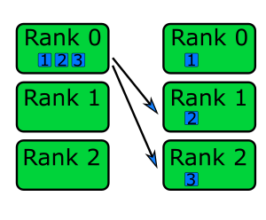

Message passing
===============

.. questions::

   - What is MPI

.. instructor-note::

   - 15 min teaching
   - 15 min exercises

MPI
---

`MPI.jl <https://github.com/JuliaParallel/MPI.jl>`_ is a Julia interface to 
the Message Passing Interface, which has been the standard workhorse of 
parallel computing for decades. Like ``Distributed``, MPI belongs to the 
distributed-memory paradigm.

The idea behind MPI is that:

- Tasks have a rank and are numbered 0, 1, 2, 3, ...
- Each task manages its own memory
- Each task can run multiple threads
- Tasks communicate and share data by sending messages.
- Many higher-level functions exist to distribute information to other tasks
  and gather information from other tasks.
- All tasks typically *run the entire code* and we have to be careful to avoid
  that all tasks do the same thing.

``MPI.jl`` provides Julia bindings for the Message Passing Interface (MPI) standard.
This is how a hello world MPI program looks like in Python:

.. code-block:: julia

   using MPI
   MPI.Init()
   comm = MPI.COMM_WORLD
   rank = MPI.Comm_rank(comm)
   size = MPI.Comm_size(comm)
   println("Hello from process $(rank) out of $(size)")
   MPI.Barrier(comm)

- ``MPI.COMM_WORLD`` is the `communicator` - a group of processes that can talk to each other
- ``Comm_rank`` returns the individual rank (0, 1, 2, ...) for each task that calls it
- ``Comm_size`` returns the total number of ranks.

To run this code with a specific number of processes we use the ``mpirun`` command which 
comes with the MPI library:

.. code-block:: console

   # on some HPC systems you might need 'srun -n 4' instead of 'mpirun -np 4'
   # on Vega, add this module for MPI libraries: ml add foss/2020b  
   $ mpirun -np 4 julia hello.jl

   # Hello from process 1 out of 4
   # Hello from process 0 out of 4
   # Hello from process 2 out of 4
   # Hello from process 3 out of 4

Point-to-point and collective communication
^^^^^^^^^^^^^^^^^^^^^^^^^^^^^^^^^^^^^^^^^^^

The MPI standard contains a `lot of functionality <https://juliaparallel.org/MPI.jl/stable/refindex/>`__, 
but in principle one can get away with only point-to-point communication (:meth:`MPI.send` and 
:meth:`MPI.recv`). However, collective communication can sometimes require less effort as you 
will learn in an exercise below.
In any case, it is good to have a mental model of different communication patterns in MPI.

.. figure:: img/send-recv.png
   :align: center
   :scale: 100 %

   ``send`` and ``recv``: blocking point-to-point communication between two ranks.    

.. figure:: img/gather.png
   :align: right
   :scale: 80 %

   ``gather``: all ranks send data to rank ``root``.

   ``scatter``: data on rank 0 is split into chunks and sent to other ranks

.. figure:: img/broadcast.png
   :align: left
   :scale: 80 %

   ``bcast``: broadcast message to all ranks

   ``reduce``: ranks send data which are reduced on rank ``root``

Examples
~~~~~~~~

.. tabs::
 
   .. tab:: send/recv

      .. literalinclude:: code/send_recv.jl
         
   .. tab:: broadcast

      .. literalinclude:: code/broadcast.jl

   .. tab:: gather
      
      .. literalinclude:: code/gather.jl

   .. tab:: scatter

      .. literalinclude:: code/scatter.jl

   .. tab:: reduce

      .. literalinclude:: code/reduce.jl

.. callout:: Serialised vs buffer-like objects

   Lower-case methods (e.g. :meth:`send` and :meth:`recv`) are used to communicate generic 
   objects between MPI processes. It is also possible to send buffer-like ``isbits`` objects 
   which provides faster communication, but require the memory space to be allocated for the 
   receiving buffer prior to communication. These methods start with uppercase letters, 
   e.g. :meth:`Send`, :meth:`Recv`, :meth:`Gather` etc.   

.. callout:: Mutating vs non-mutating 

   For communication operations which receive data, MPI.jl typically
   defines two separate functions:

   - One function in which the output buffer is supplied by the user.
     as it mutates this value, it adopts the Julia convention of suffixing
     with ``!`` (e.g. :meth:`MPI.Recv!`, :meth:`MPI.Reduce!`).
   - One function which allocates the buffer for the output
     (:meth:`MPI.Recv`, :meth:`MPI.Reduce`).

Blocking and non-blocking communication
~~~~~~~~~~~~~~~~~~~~~~~~~~~~~~~~~~~~~~~

Point-to-point communication can be *blocking* or *non-blocking*: 
:meth:`MPI.Send` will only return when the program can safely modify the send buffer and 
:meth:`MPI.Recv` will only return once the data has been received and written to the receive 
buffer.

Consider the following example of a **deadlock** caused by blocking communication. 
The problem can be circumvented by introducing sequential sends and receives, but 
it's more conveniently solved by using non-blocking send and receive.

.. tabs:: 

   .. tab:: Blocking communication deadlock

      .. literalinclude:: code/deadlock.jl
         :language: julia
         :emphasize-lines: 23, 26

   .. tab:: Workaround with blocking communication

      .. literalinclude:: code/deadlock_blocking_workaround.jl
         :language: julia
         :emphasize-lines: 25, 30, 35, 39

    
   .. tab:: Non-blocking solution

      .. literalinclude:: code/deadlock_nonblocking_solution.jl
         :language: julia
         :emphasize-lines: 23, 26, 29, 31

Exercises
---------         

.. exercise:: From blocking to non-blocking

   Consider the following two examples where data is sent around "in a circle" 
   (0->1, 1->2, ..., N->0). Will it work as intended? 

      .. code-block:: julia
      
         using MPI
         MPI.Init()

         comm = MPI.COMM_WORLD
         rank = MPI.Comm_rank(comm)
         size = MPI.Comm_size(comm)

         # where to send to
         dst = mod(rank+1, size)
         # where to receive from
         src = mod(rank-1, size)

         # unititalised send and receive buffers
         send_mesg = Array{Float64}(undef, 5)
         recv_mesg = Array{Float64}(undef, 5)

         # fill the send array
         fill!(send_mesg, Float64(rank))

         print("$rank: Sending   $rank -> $dst = $send_mesg\n")
         MPI.Send(send_mesg, comm, dest=dst, tag=rank+32)

         print("$rank: Received $src -> $rank = $recv_mesg\n")
         MPI.Recv!(recv_mesg, comm, source=src,  tag=src+32)

         MPI.Barrier(comm)

   Try running this program. Were the arrays received successfully? 
   Introduce non-blocking communication to solve the problem.

   .. solution:: 

      .. code-block:: julia
            
         using MPI
         MPI.Init()

         comm = MPI.COMM_WORLD
         rank = MPI.Comm_rank(comm)
         size = MPI.Comm_size(comm)

         # where to send to
         dst = mod(rank+1, size)
         # where to receive from
         src = mod(rank-1, size)

         send_mesg = Array{Float64}(undef, 5)
         recv_mesg = Array{Float64}(undef, 5)

         # fill the send array
         fill!(send_mesg, Float64(rank))

         print("$rank: Sending   $rank -> $dst = $send_mesg\n")
         sreq = MPI.Isend(send_mesg, comm, dest=dst, tag=rank+32)

         rreq = MPI.Irecv!(recv_mesg, comm, source=src,  tag=src+32)

         stats = MPI.Waitall!([rreq, sreq])

         print("$rank: Received $src -> $rank = $recv_mesg\n")

         MPI.Barrier(comm)

Limitations
-----------

MPI.jl has (as of October 2022) not reached v1.0 so future changes could be backwards incompatible. 

The MPI.jl documentation has a section on `known issues <https://juliaparallel.org/MPI.jl/latest/knownissues/>`__. 

See also
--------

- `MPI.jl documentation <https://juliaparallel.org/MPI.jl/stable/>`__
- `Introductory MPI lesson <https://pdc-support.github.io/introduction-to-mpi/>`__

.. keypoints::

   - MPI is a standard work-horse of parallel computing.
   - Programming with MPI requires a different mental model.
   - Each parallel rank is executing the same program and the programmer needs to distribute 
     the work by hand.

