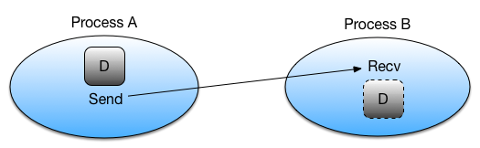
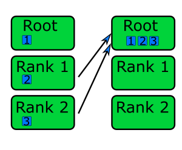

Message passing
===============

.. questions::

   - How is MPI different from Distributed.jl?
   - What methods for parallelisation exist in MPI?

.. instructor-note::

   - 20 min teaching
   - 20 min exercises

The ``MPI.jl``
--------------

`MPI.jl <https://github.com/JuliaParallel/MPI.jl>`_ is a Julia interface to 
the Message Passing Interface, which has been the standard workhorse of 
parallel computing for decades. Like ``Distributed``, MPI belongs to the 
distributed-memory paradigm.

The idea behind MPI is that:

- Tasks have a rank and are numbered 0, 1, 2, 3, ...
- Each task manages its own memory
- Each task can run multiple threads
- Tasks communicate and share data by sending messages.
- Many higher-level functions exist to distribute information to other tasks
  and gather information from other tasks.
- All tasks typically *run the entire code* and we have to be careful to avoid
  that all tasks do the same thing.

``MPI.jl`` provides Julia bindings for the Message Passing Interface (MPI) standard.
This is how a hello world MPI program looks like in Julia:

.. code-block:: julia

   using MPI
   MPI.Init()
   comm = MPI.COMM_WORLD
   rank = MPI.Comm_rank(comm)
   size = MPI.Comm_size(comm)
   println("Hello from process $(rank) out of $(size)")
   MPI.Barrier(comm)

- ``MPI.COMM_WORLD`` is the `communicator` - a group of processes that can talk to each other
- ``Comm_rank`` returns the individual rank (0, 1, 2, ...) for each task that calls it
- ``Comm_size`` returns the total number of ranks.

To run this code with a specific number of processes we use the ``mpiexecjl`` command which 
can be installed as a wrapper of the MPI command ``mpiexec`` (see :doc:`setup`):

.. code-block:: console

   $ mpiexecjl -np 4 julia hello.jl

   # Hello from process 1 out of 4
   # Hello from process 0 out of 4
   # Hello from process 2 out of 4
   # Hello from process 3 out of 4

.. demo:: MPI configuration

   ``MPI.jl`` can use either a JLL-provided MPI library, which can be automatically installed when installing ``MPI.jl``, or a system-provided MPI backend. Normally the latter option is appropriate on an HPC cluster.

   To install and configure ``MPI.jl`` with a particular MPI backend on a cluster, first load the preferred MPI library, e.g.
   
   .. code-block:: console
   
      $ module load OpenMPI
   
   Then, in a Julia session:
   
   .. code-block:: julia
   
      using Pkg
      Pkg.add("MPI")
      Pkg.add("MPIPreferences")
   
      using MPIPreferences
      MPIPreferences.use_system_binary()
   
   This will create a file ``LocalPreferences.toml`` in the default Julia directory, e.g. 
   ``$HOME/.julia/environments/v1.8``, with content similar to the following:
   
   .. code-block:: toml
   
      [MPIPreferences]
      _format = "1.0"
      abi = "OpenMPI"
      binary = "system"
      libmpi = "libmpi"
      mpiexec = "mpiexec"  

Point-to-point and collective communication
-------------------------------------------

The MPI standard contains a `lot of functionality <https://juliaparallel.org/MPI.jl/stable/refindex/>`_, 
but in principle one can get away with only point-to-point communication (:meth:`MPI.send` and 
:meth:`MPI.recv`). However, collective communication can sometimes require less effort as you 
will learn in an exercise below.
In any case, it is good to have a mental model of different communication patterns in MPI.

   ``send`` and ``recv``: blocking point-to-point communication between two ranks.    

   ``gather``: all ranks send data to rank ``root``.

.. figure:: img/scatter.png
   :align: center
   :scale: 80 %

   ``scatter``: data on rank 0 is split into chunks and sent to other ranks

.. figure:: img/broadcast.png
   :align: left
   :scale: 80 %

   ``bcast``: broadcast message to all ranks

.. figure:: img/reduction.png
   :align: center
   :scale: 100 %

   ``reduce``: ranks send data which are reduced on rank ``root``

.. callout:: Serialised vs buffer-like objects

   Lower-case methods (e.g. :meth:`MPI.send` and :meth:`MPI.recv`) are used to communicate generic 
   objects between MPI processes. It is also possible to send buffer-like ``isbits`` objects 
   which provides faster communication, but require the memory space to be allocated for the 
   receiving buffer prior to communication. These methods start with uppercase letters, 
   e.g. :meth:`MPI.Send`, :meth:`MPI.Recv`, :meth:`MPI.Gather` etc.   

.. callout:: Mutating vs non-mutating 

   For communication operations which receive data, MPI.jl typically
   defines two separate functions:

   - One function in which the output buffer is supplied by the user.
     As it mutates this value, it adopts the Julia convention of suffixing
     with ``!`` (e.g. :meth:`MPI.Recv!`, :meth:`MPI.Reduce!`).
   - One function which allocates the buffer for the output
     (:meth:`MPI.Recv`, :meth:`MPI.Reduce`).

.. _Examples:

Examples
--------

.. tabs::
 
   .. tab:: send/recv

      .. literalinclude:: code/send_recv.jl
         :language: julia
         
   .. tab:: broadcast

      .. literalinclude:: code/broadcast.jl
         :language: julia

   .. tab:: gather
      
      .. literalinclude:: code/gather.jl
         :language: julia

   .. tab:: scatter

      .. literalinclude:: code/scatter.jl
         :language: julia

   .. tab:: reduce

      .. literalinclude:: code/reduce.jl
         :language: julia

Blocking and non-blocking communication
---------------------------------------

Point-to-point communication can be *blocking* or *non-blocking*: 

- :meth:`MPI.Send` will only return when the program can safely modify the send buffer and 
- :meth:`MPI.Recv` will only return once the data has been received and written to the receive buffer.

Consider the following example of a **deadlock** caused by blocking communication. 
The problem can be circumvented by introducing sequential sends and receives, but 
it's more conveniently solved by using non-blocking send and receive.

.. tabs:: 

   .. tab:: Blocking communication deadlock

      .. literalinclude:: code/deadlock.jl
         :language: julia

   .. tab:: Workaround with blocking communication

      .. literalinclude:: code/deadlock_blocking_workaround.jl
         :language: julia
    
   .. tab:: Non-blocking solution

      .. literalinclude:: code/deadlock_nonblocking_solution.jl
         :language: julia

Exercises
---------         

.. exercise:: Run the examples of point-to-point and collective communication

   Take the examples of point-to-point and collective communication methods from the 
   :ref:`Examples` section above, and run them locally or on a cluster. 

   Try to understand exactly the program flow and what each rank is doing.

.. exercise:: From blocking to non-blocking

   Consider the following example where data is sent around "in a circle" 
   (0->1, 1->2, ..., N->0). Will it work as intended? 

      .. code-block:: julia
      
         using MPI
         MPI.Init()

         comm = MPI.COMM_WORLD
         rank = MPI.Comm_rank(comm)
         size = MPI.Comm_size(comm)

         # where to send to
         dst = mod(rank+1, size)
         # where to receive from
         src = mod(rank-1, size)

         # unititalised send and receive buffers
         send_mesg = Array{Float64}(undef, 5)
         recv_mesg = Array{Float64}(undef, 5)

         # fill the send array
         fill!(send_mesg, Float64(rank))

         print("$rank: Sending   $rank -> $dst = $send_mesg\n")
         MPI.Send(send_mesg, comm, dest=dst, tag=rank+32)

         MPI.Recv!(recv_mesg, comm, source=src,  tag=src+32)
         print("$rank: Received $src -> $rank = $recv_mesg\n")

         MPI.Barrier(comm)

   Try running this program. Were the arrays received successfully? 
   Introduce non-blocking communication to solve the problem.

   .. solution:: Explanation for why this code *might* work

      This code *might* work correctly, but it's not _guaranteed_ to work! This depends on the backend MPI library (OpenMPI or MPICH). :meth:`MPI.Send` can run in one of several modes, and usually *standard* mode is the default which means that the library decides based on performance reasons whether to *buffer* the send message or not - if it does, the send can complete before a matching receive has been invoked. It might stop working if you're sending larger amounts of data, so you need to use non-blocking communication instead.    

      More details in `this StackOverflow post <https://stackoverflow.com/questions/10017301/mpi-blocking-vs-non-blocking>`__.

   .. solution:: 

      .. code-block:: julia
            
         using MPI
         MPI.Init()

         comm = MPI.COMM_WORLD
         rank = MPI.Comm_rank(comm)
         size = MPI.Comm_size(comm)

         # where to send to
         dst = mod(rank+1, size)
         # where to receive from
         src = mod(rank-1, size)

         send_mesg = Array{Float64}(undef, 5)
         recv_mesg = Array{Float64}(undef, 5)

         # fill the send array
         fill!(send_mesg, Float64(rank))

         print("$rank: Sending   $rank -> $dst = $send_mesg\n")
         sreq = MPI.Isend(send_mesg, comm, dest=dst, tag=rank+32)

         rreq = MPI.Irecv!(recv_mesg, comm, source=src,  tag=src+32)

         stats = MPI.Waitall!([rreq, sreq])

         print("$rank: Received $src -> $rank = $recv_mesg\n")

.. challenge:: MPI-parallelise :meth:`compute_pi` function

   .. figure:: img/pi_with_darts.png
      :scale: 7 %
      :align: right

   Consider again the following function which estimates π by "throwing darts", 
   i.e. randomly sampling (x,y) points in the interval [0.0, 1.0] and checking 
   if they fall within the unit circle.

   .. literalinclude:: code/estimate_pi.jl
      :language: julia

   .. code-block:: julia

      num_points = 100_000_000
      estimate_pi(num_points)  # 3.14147572...

   There are several ways in which this function could be parallelised with MPI. Below you will 
   find two working solutions using collective communication: 
   
   - One implements an unnecessarily complicated algorithm, which nonetheless is illustrative for 
     more general cases.
   - The other implements a more compact and efficient solution. 
   
   Inspect the complicated solution first and answer the questions!

   .. tabs:: 

      .. tab:: Dividing indices between ranks

         Study the following fully functional MPI code and then answer the questions below. Feel free 
         to add print statements to the code and run it with 
         ``mpiexecjl -np <N> julia estimate_pi.jl`` to understand what's going on.

         .. literalinclude:: code/estimate_pi_mpi_general.jl
            :language: julia

         1. For ``num_jobs = 10`` and ``size = 4``, what would be the values of ``count`` and ``remainder``?
         2. What is the purpose of the if-else block starting with ``if rank < remainder``?
         3. For ``num_jobs = 10`` and ``size = 4``, what would be the values of ``first`` and 
            ``last`` for each rank?
         4. Is load-balancing an issue in this solution? (i.e. how evenly work is split between tasks)
         5. Would you expect this MPI solution to perform and scale similarly well to the distributed 
            :meth:`pmap` solution we saw in the :doc:`distributed` episode?
         6. Can you think of any improvements to the MPI algorithm algorithm employed?
         7. Now look at the more compact solution!
            

         .. solution::

            1. :meth:`div` performs integer division, and ``div(10, 4) = 2``. The ``%`` operator 
               computes the remainder from integer division and ``10 % 4 = 2``.
            2. This block splits indices of the chunks vector between ranks. The first ``remainder`` 
               ranks get ``count + 1`` tasks each, remaining ``num_jobs - remainder`` ranks get 
               ``count`` tasks each.
            3. ``{rank 0 : [1,2,3], rank 1 : [4,5,6], rank 2 : [7,8], rank 3 : [9,10]}``
            4. Yes, load balancing is an issue because all ranks do not get equal amount of work.
            5. It will depend on the load balancing! With e.g. 2 ranks, both ranks will have equal work and the performance 
               will be very close to the :meth:`pmap` solution with 2 workers. With 4 ranks, the 
               load-balancing will be poorer for this MPI solution and it will perform worse than :meth:`pmap`.
            6. Splitting vector (or array) indices between MPI tasks is a common construct and useful 
               to know well. In this case, however, it's overkill. It will be enough to divide 
               ``num_points`` evenly between the ranks.

      .. tab:: Compact

         Study the following fully functional MPI code and then answer the questions below. Feel free 
         to add print statements to the code and run it with 
         ``mpiexecjl -np <N> julia estimate_pi.jl`` to understand what's going on.

         .. literalinclude:: code/estimate_pi_mpi_compact.jl
            :language: julia

         The algorithm to split work is significantly simpler here with ``num_points`` divided as 
         evenly as possible between the ranks.

         1. Is load balancing better in this solution? What's the "worst case" load imbalance?
         2. How does the performance of this MPI version compare to the distributed :meth:`pmap` 
            version that we saw in the :doc:`distributed` episode?

         .. solution::

            1. Load balancing is in general much better in this version. The worst case is a 
               difference of one single point between ranks.
            2. The performance is statistically equivalent to the :meth:`pmap` version!

Limitations
-----------

``MPI.jl`` has (as of October 2023) not reached v1.0 so future changes could be backwards incompatible. 

The ``MPI.jl`` documentation has a section on `known issues <https://juliaparallel.org/MPI.jl/latest/knownissues/>`_. 

See also
--------

- `MPI.jl documentation <https://juliaparallel.org/MPI.jl/stable/>`_.
- `Introductory MPI lesson <https://pdc-support.github.io/introduction-to-mpi/>`_.

.. keypoints::

   - MPI is a standard work-horse of parallel computing.
   - All communication is handled explicitly - not behind the scenes as in ``Distributed``.
   - Programming with MPI requires a different mental model since each parallel rank is executing 
     the same program and the programmer needs to distribute the work by hand.

