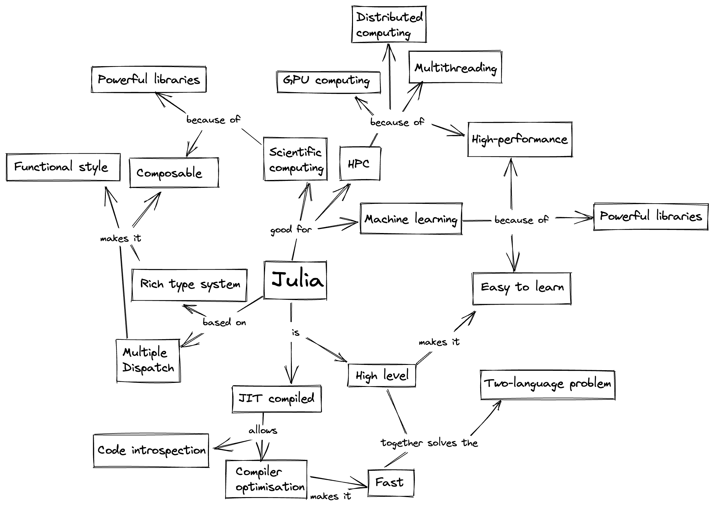

Summary and outlook
===================

.. questions::

   - What have we learned so far?
   - What libraries are available for scientific computing in Julia?
   - Where should I go from here?

.. instructor-note::

   - 10 min teaching

Where to go from here
---------------------

Additional learning resources can be found at https://julialang.org/learning/.

If you want to dig deeper into topics touched upon in this material, please visit:

- The various links under See also sections in the lesson episodes.
- https://juliagpu.org/ for everything about Julia GPU programming.
- https://github.com/JuliaParallel for parallelization packages.
- https://github.com/JuliaInterop for interoperability between Julia and not-Julia

The `Julia discourse platform <https://discourse.julialang.org/>`__ is a place to 
search for existing questions and answers and to ask new questions. Core developers 
and experienced Julia programmers are generous with advice and friendly to newcomers. 

There is also an active `Slack workspace/community <https://julialang.org/slack/>`__ 
with over 10,000 members. This is a space to have quick and informal correspondence with 
others in the community.

Interesting blog posts about Julia are posted on the `Julia Forem <https://forem.julialang.org/>`__.

`Julia Computing <https://juliacomputing.com/>`__ organises regular free webinars and sends 
out a regular newsletter with the latest news on Julia.

`JuliaCon <https://juliacon.org/2022/>`__ is organized annually in July and participation 
is free. 

`SciMLCon <https://scimlcon.org/2022/>`__ was organized for the first time in 2022 
and is focused on the development and applications of the Julia-based SciML 
(scientific machine learning) tooling. Participation is free.

Ecosystem of scientific computing packages
^^^^^^^^^^^^^^^^^^^^^^^^^^^^^^^^^^^^^^^^^^

Julia has a rich and rapidly expanding ecosystem of packages for scientific computing 
in many scientific domains. In many cases developers of individual packages join forces 
to create mutually compatible and supporting packages organized under a common GitHub 
organization. The following list can be of some help in navigating the ecosystem.

Mathematics
~~~~~~~~~~~

- `JuliaDiff <https://github.com/JuliaDiff/>`_  – Differentiation tools
- `JuliaGeometry <https://github.com/JuliaGeometry>`_   – Computational Geometry
- `JuliaGraphs <https://github.com/JuliaGraphs>`_     – Graph Theory and Implementation
- `JuliaIntervals <https://github.com/JuliaIntervals>`_  - Rigorous numerics with interval arithmetic & applications
- `JuliaMath <https://github.com/JuliaMath>`_       – Mathematics made easy in Julia
- `JuliaOpt <https://github.com/JuliaOpt>`_        – Optimization 
- `JuliaPolyhedra <https://github.com/JuliaPolyhedra>`_  – Polyhedral computation
- `JuliaSparse <https://github.com/JuliaSparse>`_     – Sparse matrix solvers
- `JuMP-dev <https://github.com/jump-dev>`__          - Modeling language for mathematical optimization

Scientific domains
~~~~~~~~~~~~~~~~~~

- `BioJulia <https://github.com/BioJulia>`_ – Biology 
- `EcoJulia <https://github.com/EcoJulia>`_  – Ecology
- `JuliaAstro <https://github.com/JuliaAstro>`_  – Astronomy 
- `JuliaDSP <https://github.com/JuliaDSP>`_  – Digital signal processing
- `JuliaQuant <https://github.com/JuliaQuant>`_  – Finance
- `JuliaQuantum <https://github.com/JuliaQuantum>`_  – Julia libraries for quantum science and technology 
- `QuantumBFS <https://github.com/QuantumBFS/Yao.jl>`_  – Extensible, Efficient Quantum Algorithm Design for Humans
- `JuliaPhysics <https://github.com/JuliaPhysics>`_  – Physics
- `JuliaDynamics <https://github.com/JuliaDynamics>`_  - Dynamical systems, nonlinear dynamics and chaos.

Data sciences
~~~~~~~~~~~~~

- `SciML <https://github.com/SciML>`_   – Scientific machine learning 
- `FluxML <https://github.com/FluxML/>`_ - Machine learning stack
- `JuliaML <https://github.com/JuliaML>`_  – Machine Learning
- `JuliaStats <https://github.com/JuliaStats>`_  – Statistics
- `JuliaImages <https://github.com/JuliaImages>`_  – Image Processing
- `JuliaText <https://github.com/JuliaText>`_  – Natural Language Processing  (NLP), Computational Linguistics and (textual) Information Retrieval
- `JuliaDatabases <https://github.com/JuliaDatabases>`_ – Various database drivers for Julia
- `JuliaData <https://github.com/JuliaData>`_ – Data manipulation, storage, and I/O in Julia

.. discussion:: Scientific computing libraries

   - Which, if any, libraries and packages do you currently use for scientific computing?
   - Do you see something interesting in the list above?

Summary
-------

.. discussion:: Take home messages

   - What did you find most interesting in this lesson?
   - What did you find most useful in this lesson?
   - What would you like to learn more about?

.. challenge:: Make a concept map 

   `Concept maps <https://en.wikipedia.org/wiki/Concept_map>`__, like the one above, can be 
   useful to organise one's knowledge and help with planning projects.

   Draw a concept map of a project for which you want to use Julia. It can either focus on the 
   scientific/engineering aspects or on the software side, or both.  
   You can use pen and paper or online tools such as `Excalidraw <https://excalidraw.com/>`__.

