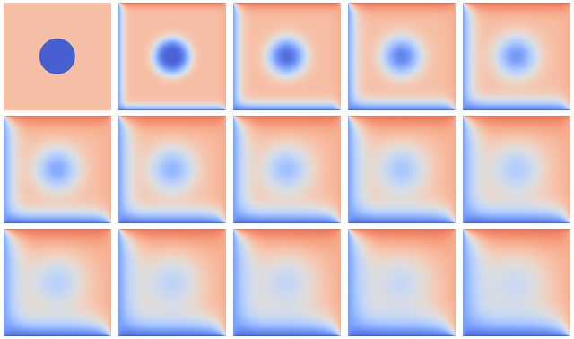

Advanced exercises
==================

.. instructor-note::

   - 0 min teaching
   - 30 min exercises

Example use case: heat flow in two-dimensional area
---------------------------------------------------

Heat flows in objects according to local temperature differences, as if seeking local equilibrium. The following example defines a rectangular area with two always-warm sides (temperature 70 and 85), two cold sides (temperature 20 and 5) and a cold disk at the center. Because of heat diffusion, temperature of neighboring patches of the area is bound to equalize, changing the overall distribution:

   
   Over time, the temperature distribution progresses from the initial state toward an end state where upper triangle is warm and lower is cold. The average temperature tends to (70 + 85 + 20 + 5) / 4 = 45.

Technique: stencil computation
~~~~~~~~~~~~~~~~~~~~~~~~~~~~~~

Heat transfer in the system above is governed by the partial differential equation(s) describing local variation of the temperature field in time and space. That is, the rate of change of the temperature field :math:`u(x, y, t)` over two spatial dimensions :math:`x` and :math:`y` and time :math:`t` (with rate coefficient :math:`\alpha`) can be modelled via the equation

.. math::
   \frac{\partial u}{\partial t} = \alpha \left( \frac{\partial^2 u}{\partial x^2} + \frac{\partial^2 u}{\partial x^2}\right)
   
The standard way to numerically solve differential equations is to *discretize* them, i. e. to consider only a set/ grid of specific area points at specific moments in time. That way, partial derivatives :math:`{\partial u}` are converted into differences between adjacent grid points :math:`u^{m}(i,j)`, with :math:`m, i, j` denoting time and spatial grid points, respectively. Temperature change in time at a certain point can now be computed from the values of neighboring points at earlier time; the same expression, called *stencil*, is applied to every point on the grid.

.. figure:: img/stencil.svg
   :align: center

   This simplified model uses an 8x8 grid of data in light blue in state
   :math:`m`, each location of which has to be updated based on the
   indicated 5-point stencil in yellow to move to the next time point
   :math:`m+1`.

The following series of exercises uses this stencil example implemented in Julia. 
The source files listed below represent a simplification of this `HeatEquation package <https://github.com/ENCCS/HeatEquation.jl>`__, which in turn is inspired by `this educational repository containing C/C++/Fortran versions with different parallelization strategies <https://github.com/cschpc/heat-equation>`_ (credits to CSC Finland) (you can also find the source files in the content/code/stencil/ directory of this repository).

.. tabs:: 

   .. tab:: main.jl

      .. literalinclude:: code/stencil/main.jl
         :language: julia

   .. tab:: core.jl

      .. literalinclude:: code/stencil/core.jl
         :language: julia

   .. tab:: heat.jl

      .. literalinclude:: code/stencil/heat.jl
         :language: julia

   .. tab:: Project.toml

      .. literalinclude:: code/stencil/Project.toml
         :language: julia         

.. challenge:: Run the code

   - Copy the source files from the code box above.
   - Activate the environment found in the Project.toml file.
   - Run the main.jl code and (optionally) visualise the result by uncommenting the relevant line.
   - Study the code for a while to understand how it works.

.. challenge:: Optimise and benchmark

   - Benchmark the :meth:`evolve!` function in the Julia REPL. 
   - Add the ``@inbounds`` macro to the innermost loop.
   - Benchmark again and estimate the performance gain.

   .. solution:: 

      - Add the ``@btime`` macro and execute in VSCode:

        .. code-block:: julia

           @btime simulate!(curr, prev, nsteps)
           

.. challenge:: Multithread 

   - Multithread the :meth:`evolve!` function
   - Benchmark again with different number of threads. It will be most convenient to 
     run these benchmarks from the command line where you can set the number of threads: `julia -t <nthreads>`.
   - How does it scale?

   .. solution::

      .. code-block:: julia

         function evolve!(curr::Field, prev::Field, a, dt)
             Threads.@threads for j = 2:curr.ny+1
                 for i = 2:curr.nx+1
                     @inbounds xderiv = (prev.data[i-1, j] - 2.0 * prev.data[i, j] + prev.data[i+1, j]) / curr.dx^2
                     @inbounds yderiv = (prev.data[i, j-1] - 2.0 * prev.data[i, j] + prev.data[i, j+1]) / curr.dy^2
                     @inbounds curr.data[i, j] = prev.data[i, j] + a * dt * (xderiv + yderiv)
                 end 
             end
         end
      
      Running benchmarking from terminal:

      .. code-block:: bash

         $ julia --project -t 1 main.jl
         #   1.088 s (4032 allocations: 64.35 MiB)
         $ julia --project -t 2 main.jl
         #   612.132 ms (7009 allocations: 64.62 MiB)
         $ julia --project -t 4 main.jl
         #   474.350 ms (13294 allocations: 65.19 MiB)
       
      The scaling isn't very good because the loops in ``evolve!`` are rather cheap.

.. exercise:: Adapt the stencil problem for GPU porting

   In order to prepare for porting the stencil problem to run on a GPU, it's wise to modify the code slightly. One approach is to change the ``evolve!`` function to accept arrays instead of ``Field`` types. For now, we define a new version of this function called :meth:`evolve2`:

   .. code-block:: julia

      function evolve2!(currdata::AbstractArray, prevdata::AbstractArray, dx, dy, a, dt)
          nx, ny = size(currdata) .- 2
          for j = 2:ny+1
              for i = 2:nx+1
                  @inbounds xderiv = (prevdata[i-1, j] - 2.0 * prevdata[i, j] + prevdata[i+1, j]) / dx^2
                  @inbounds yderiv = (prevdata[i, j-1] - 2.0 * prevdata[i, j] + prevdata[i, j+1]) / dy^2
                  @inbounds currdata[i, j] = prevdata[i, j] + a * dt * (xderiv + yderiv)
              end 
          end
      end 

   - In the :meth:`simulate!` function, update how you call the :meth:`evolve2!` function.
   - Take a moment to study the :meth:`initialize` function. Why is the `if arraytype != Matrix` statement there?

   .. solution::

      In the :meth:`simulate!` function you need to change from:

      .. code-block:: julia

         evolve!(curr, prev, a, dt)

      to:

      .. code-block:: julia

         evolve2!(curr.data, prev.data, curr.dx, curr.dy, a, dt)

      The purpose of the if-else block in :meth:`initialize` is to handle situations where you want the data arrays in the Field composite types to be something else than regular Matrix types. This will be needed when we port to GPU, and also when using SharedArrays.

.. exercise:: Using SharedArrays with stencil problem

   Look again at the double for-loop in the modified ``evolve!`` function 
   and think about how you could use SharedArrays. Start from the :meth:`evolve2!` function defined above, and try to implement a version that accepts `SharedArray` arrays.

   .. solution:: Hints

      - In your `main` script, import also ``Distributed`` and ``SharedArrays``. 
      - In ``core.jl``, create another method for the ``evolve2!`` function with the following signature: ``evolve2!(currdata::SharedArray, prevdata::SharedArray, dx, dy, a, dt)``
      - The only change you have to make to the SharedArray method of :meth:`evolve2!` is to add ``@sync @distributed`` in front of the first loop!

   .. solution:: Solution and benchmarking

      This is how the SharedArray method should look:

      .. code-block:: julia

         function evolve2!(currdata::SharedArray, prevdata::SharedArray, dx, dy, a, dt)
             nx, ny = size(currdata) .- 2
             @sync @distributed for j = 2:ny+1
                 for i = 2:nx+1
                     @inbounds xderiv = (prevdata[i-1, j] - 2.0 * prevdata[i, j] + prevdata[i+1, j]) / dx^2
                     @inbounds yderiv = (prevdata[i, j-1] - 2.0 * prevdata[i, j] + prevdata[i, j+1]) / dy^2
                     @inbounds currdata[i, j] = prevdata[i, j] + a * dt * (xderiv + yderiv)
                 end
             end
         end         

      and this is how you would set up the simulation in the `main` file:

      .. code-block:: julia

         using BenchmarkTools
         using Distributed
         using SharedArrays
         include("heat.jl")
         include("core.jl")
         # ... definition of visualize()
         ncols, nrows = 2048, 2048
         nsteps = 10
         curr, prev = initialize(ncols, nrows, SharedArray)
         @btime simulate!(curr, prev, nsteps)

      To run the script with multiple processes:

      .. code-block:: console

         $ julia -p 4 --project main.jl

      NOTE: Your benchmark results will turn out to be underwhelming - the SharedArray version will most likely run slower! See explanation below.

   .. solution:: Notes on performance

     - The overhead in managing the workers will probably far outweigh the 
       parallelisation benefit because the computation in the inner loop is 
       very simple and extremely fast. 
     - To see the benefit you can obtain for more computationally demanding calculations, you can try to introduce a more expensive mathematical operation to the inner loop, e.g. by taking the arctangent of some values:
       
       .. code-block:: julia

          @inbounds xderiv = (atan(prevdata[i-1, j]) - 2.0 * atan(prevdata[i, j]) + atan(prevdata[i+1, j])) / dx^2
          @inbounds yderiv = (atan(prevdata[i, j-1]) - 2.0 * atan(prevdata[i, j]) + atan(prevdata[i, j+1])) / dy^2

      This should clearly demonstrate the performance benefit of parallelisation via SharedArrays:

      .. code-block:: console

         $ julia -p 1 --project main.jl
         #    1.840 s (442 allocations: 64.03 MiB)
         $ julia -p 4 --project main.jl
         #    513.529 ms (8315 allocations: 64.39 MiB)

.. challenge:: Exercise: Julia port to GPUs

   Carefully inspect all Julia source files and consider the following questions:

   1. Which functions should be ported to run on GPU?
   2. Look at the :meth:`initialize!` function and how it uses the ``arraytype`` argument. This could be done more compactly and elegantly, but this solution solves scalar indexing errors. What are scalar indexing errors?
   3. Try to start sketching GPU-ported versions of the key functions.
   4. When you have a version running on a GPU (your own or the solution provided below), try benchmarking it by adding ``@btime`` in front of :meth:`simulate!` in ``main.jl``. Benchmark also the CPU version, and compare.

   Further considerations:

   1. The kernel function needs to end with ``return`` or ``return nothing``.

   2. The arrays are two-dimensional, so you will need both the ``.x`` and ``.y`` 
      parts of ``threadIdx()``, ``blockDim()`` and ``blockIdx()``.

      - Does it matter how you match the ``x`` and ``y`` dimensions of the 
        threads and blocks to the dimensions of the data (i.e. rows and columns)? 

   3. You also need to specify tuples 
      for the number of threads and blocks in the ``x`` and ``y`` dimensions, 
      e.g. ``threads = (32, 32)`` and similarly for ``blocks`` (using ``cld``).

      - Note the hardware limitations: the product of x and y threads cannot 
        exceed it.

   4. For debugging, you can print from inside a kernel using ``@cuprintln`` 
      (e.g. to print thread numbers). It will only print during the first 
      execution - redefine the function again to print again.
      If you get warnings or errors relating to types, you can use the code 
      introspection macro ``@device_code_warntype`` to see the types inferred 
      by the compiler.

   5. Check correctness of your results! To test that ``evolve!`` and ``evolve_gpu!`` 
      give (approximately) the same results, for example:

   .. solution:: Hints

      - create a new function :meth:`evolve_gpu!` which contains the GPU kernelized version of :meth:`evolve!`
      - in the loop over timesteps in :meth:`simulate!`, you will need a conditional like ``if typeof(curr.data) <: ROCArray`` to call your GPU-ported function
      - you cannot pass the struct ``Field`` to the kernel. You will instead need to directly pass the array ``Field.data``. This also necessitates passing in other variables like ``curr.dx^2``, etc.

   .. solution:: More hints

      - since the data is two-dimensional, you'll need ``i = (blockIdx().x - 1) * blockDim().x + threadIdx().x`` and ``j = (blockIdx().y - 1) * blockDim().y + threadIdx().y``
      - to not overindex the 2D array, you can use a conditional like ``if i > 1 && j > 1 && i < nx+2 && j < ny+2``
      - when calling the kernel, you can set the number of threads and blocks like ``xthreads = ythreads = 16`` and ``xblocks, yblocks = cld(curr.nx, xthreads), cld(curr.ny, ythreads)``, and then call it with, e.g., ``@roc threads=(xthreads, ythreads) blocks = (xblocks, yblocks) evolve_rocm!(curr.data, prev.data, curr.dx^2, curr.dy^2, nx, ny, a, dt)``.

   .. solution:: 

      1. The :meth:`evolve!` and :meth:`simulate!` functions need to be ported. The ``main.jl`` file also needs to be updated to work with GPU arrays.
      2. "Scalar indexing" is where you iterate over a GPU array, which would be excruciatingly slow and is indeed only allowed in interactive REPL sessions. Without the if-statements in the :meth:`initialize!` function, the :meth:`generate_field!` method would be doing disallowed scalar indexing if you were running on a GPU.
      3. The GPU-ported version is found below. Try it out on both CPU and GPU and observe the speedup. Play around with array size to see if the speedup is affected. You can also play around with the ``xthreads`` and ``ythreads`` variables to see if it changes anything.

      .. tabs::

         .. tab:: main_gpu.jl

            .. literalinclude:: code/stencil/main_gpu.jl
               :language: julia

         .. tab:: core_gpu.jl

            .. literalinclude:: code/stencil/core_gpu.jl
               :language: julia

      .. code-block:: julia

         dx = dy = 0.01
         a = 0.5
         nx = ny = 10000
         dt = dx^2 * dy^2 / (2.0 * a * (dx^2 + dy^2))
         A1 = rand(nx, ny);
         A2 = rand(nx, ny);
         A1_d = CuArray(A1)
         A2_d = CuArray(A2)

         evolve!(A1, A2, dx, dy, a, dt)

         evolve_gpu!(A1_d, A2_d, dx, dy, a, dt)

         all(A1 .≈ Array(A1_d))
   
   1. Perform some benchmarking of the ``evolve!`` and ``evolve_gpu!`` 
      functions for arrays of various sizes and with different choices 
      of ``nthreads``. You will need to prefix the 
      kernel execution with the ``CUDA.@sync`` macro 
      to let the CPU wait for the GPU kernel to finish (otherwise you 
      would be measuring the time it takes to only launch the kernel):

   
   2. Compare your Julia code with the 
      `corresponding CUDA version <https://github.com/cschpc/heat-equation/blob/main/cuda/core_cuda.cu>`__
      to enjoy the (relative) simplicity of Julia!

   .. solution:: 

      This is one possible GPU kernel version of ``evolve!``:

      .. code-block:: julia

         function evolve_gpu!(currdata, prevdata, dx2, dy2, a, dt)
             nx, ny = size(currdata) .- 2   
             # which index (i or j) you assign to x and y matters enormously!
             i = (blockIdx().x - 1) * blockDim().x + threadIdx().x
             j = (blockIdx().y - 1) * blockDim().y + threadIdx().y
             #@cuprintln("threads $i $j") #only for debugging!
             if i > 1 && j > 1 && i < nx+2 && j < ny+2
                 @inbounds xderiv = (prevdata[i-1, j] - 2.0 * prevdata[i, j] + prevdata[i+1, j]) / dx2
                 @inbounds yderiv = (prevdata[i, j-1] - 2.0 * prevdata[i, j] + prevdata[i, j+1]) / dy2
                 @inbounds currdata[i, j] = prevdata[i, j] + a * dt * (xderiv + yderiv)
             end
             return nothing
         end

      To test it:

      .. code-block:: julia

         dx = dy = 0.01
         a = 0.5
         nx = ny = 1000
         dt = dx^2 * dy^2 / (2.0 * a * (dx^2 + dy^2))
         M1 = rand(nx, ny);
         M2 = rand(nx, ny);

         # copy to GPU and convert to Float32
         M1_d = CuArray(cu(M1))
         M2_d = CuArray(cu(M2))

         # set number of threads and blocks
         nthreads = 16
         numblocks = cld(nx, nthreads)

         # call cpu and gpu versions
         evolve!(M1, M2, dx, dy, a, dt)
         @cuda threads=(nthreads, nthreads) blocks=(numblocks, numblocks) evolve_gpu!(M1_d, M2_d, dx^2, dy^2, a, dt)

         # element-wise comparison
         all(M1 .≈ Array(M1_d))

      To benchmark:

      .. code-block:: julia

         using BenchmarkTools
         @btime evolve!(M1, M2, dx, dy, a, dt)
         @btime CUDA.@sync @cuda threads=(nthreads, nthreads) blocks=(numblocks, numblocks) evolve_gpu!(M1_d, M2_d, dx^2, dy^2, a, dt)

.. exercise:: Create a package 

   Take the code for the stencil example and convert it into a Julia package!
   Instructions for creating Julia packages are found in the `Introduction to Julia <https://enccs.github.io/julia-intro/development/>`__ lesson.

   Also try to write one or more tests. It can include unit tests, integration tests or an end-to-end test.

   .. solution:: 

      See `HeatEquation.jl <https://github.com/ENCCS/HeatEquation.jl>`__.