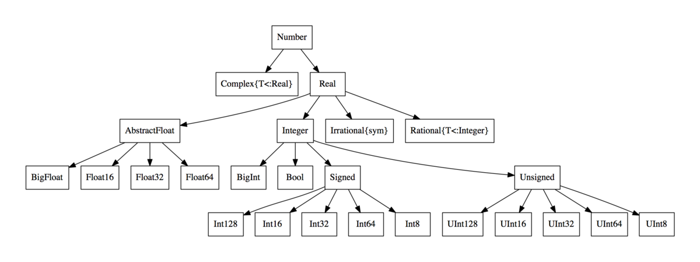
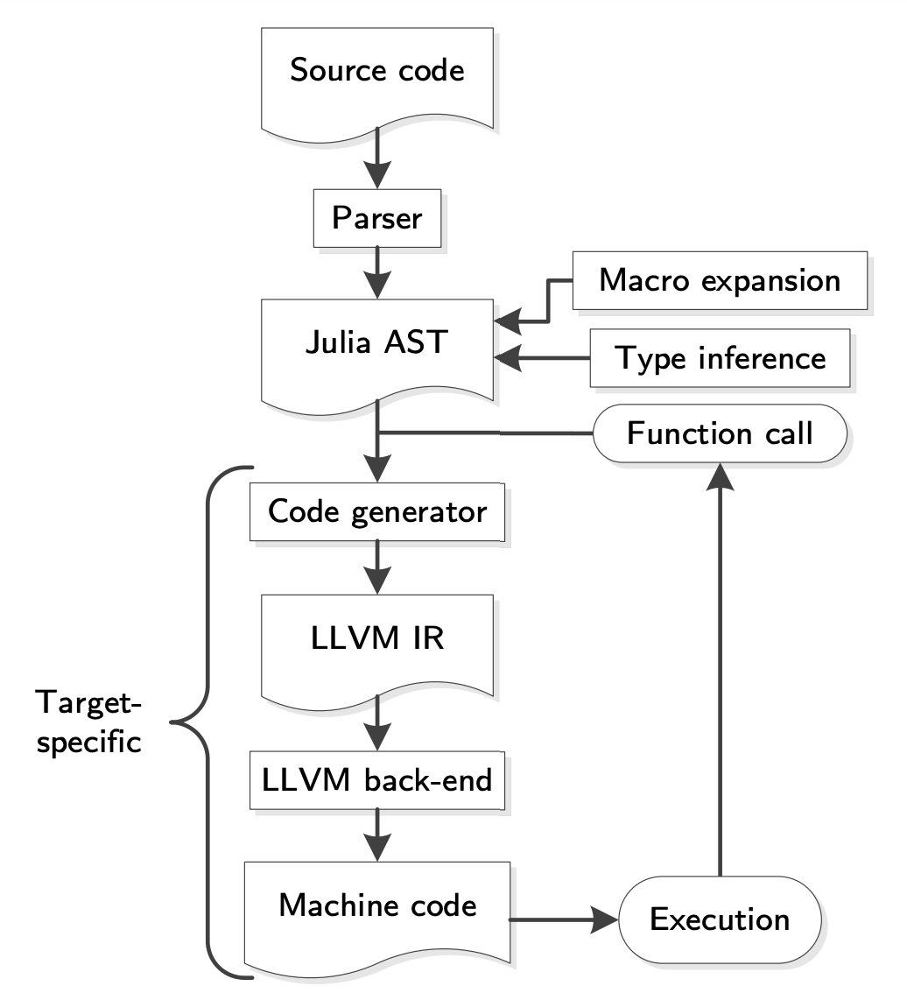

Special features of Julia
=========================

.. questions::

   - How does the type system in Julia work?
   - Is Julia dynamically or statically typed?
   - What is multiple dispatch?
   - What is code introspection?
   - What is metaprogramming?

.. instructor-note::

   - 30 min teaching
   - 30 min exercises

Types
-----

Julia is a dynamically typed language and does not require the
declaration of types, but its
sophisticated type system helps optimise Julia's performance.
This is because types are *inferred* and used at runtime.

Julia's type system is also what enables 
`multiple dispatch <https://en.wikipedia.org/wiki/Multiple_dispatch>`__ 
on function argument types - this is what sets the language apart from most other
languages and makes it fast when combined with just-in-time (JIT) compilation 
using the LLVM compiler toolchain.

Since types play a fundamental role in Julia's design it's important to
have a mental model of Julia's type system. There are two basic kinds of
types in Julia: 

- **Abstract types**: Define the kind of a thing, i.e. represent sets of related types. 
- **Concrete types**: Describe data structures, i.e. concrete implementations that 
  can be used for variables.

Types in Julia form a “type tree”, in which the leaves are concrete
types.

   From `Wikimedia <https://commons.wikimedia.org/wiki/File:Type-hierarchy-for-julia-numbers.png>`__,
   licensed under `CC BY-SA 4.0 <https://creativecommons.org/licenses/by-sa/4.0/deed.en>`__.

Composite types
~~~~~~~~~~~~~~~

New types, i.e. new kinds of data structures, can be defined with the
``struct`` keyword, or ``mutable struct`` if you want to be able to
change the values of fields in the new data structure. To take a
classical example:

.. code-block:: julia

    struct Point2D
        x
        y
    end

One can also specify types of the individual fields (but we can't redefine structs, try running 
this code!):

.. code-block:: julia

    struct Point2D
        x::Float64
        y::Float64
    end

A new ``Point2D`` object can be defined by

.. code-block:: julia

    p = Point2D(1.1, 2.2)

and its elements accessed by

.. code-block:: julia

    p.x

Constructors
~~~~~~~~~~~~

Composite type objects also serve as **constructor functions**. These create new instances of themselves 
when applied to an argument tuple as a function. Composite types have a default constructor 
which gets called when creating a new object, but it's possible to explicitly define both 
**inner** and **outer** constructor methods.

If we define an inner constructor method, no default constructor is provided any longer. Inner 
constructors have access to a special function called :meth:`new` which creates a new object:

.. code-block:: julia

   struct Point2D
       x
       y
       Point2D(c::Complex) = new(c.re, c.im)
   end   

   Point2D(1, 2)  # only works if first version of Point2D is also defined!
   # Point2D(1, 2)

   Point2D(1 + 2im)
   # Point(1, 2)

For this case, it would be better to define an additional outer constructor - just like when 
methods are added to a function:

.. code-block:: julia

   struct Point2D
       x
       y
   end   

   Point2D(c::Complex) = Point2D(c.re, c.im)

   Point2D(1, 2) 
   # Point2D(1, 2)

   Point2D(1 + 2im)
   # Point2D(1, 2)   

Parametric types
~~~~~~~~~~~~~~~~

A useful feature of Julia’s type system are *type parameters*: the
ability to use parameters when defining types. For example (using a new name since structs 
can not be redefined):

.. code-block:: julia

    struct Point{T}
        x::T
        y::T
    end

We can now create ``Point`` variables with explicitly different types:

.. code-block:: julia

    p1 = Point(1,2)
    # Point{Int64}(1, 2)

    p2 = Point(1.0, 2.0)
    # Point{Float64}(1.0, 2.0)

Parametric types introduce a new family of new types, since 
any specialized version ``Point{T}`` is a subtype of ``Point``:

.. code-block:: julia

    Point{Int64} <: Point   # returns true
    Point{Float64} <: Point   # returns true

Design patterns
~~~~~~~~~~~~~~~

Julia is a multi-paradigm language that supports multiple types of 
design patterns, including object-oriented patterns. However, the Julian 
approach is to build code around the type system and this has a different 
architecture than object-oriented languages.

Many Julia applications are built around *type hierarchies* involving 
both abstract and concrete types. Abstract types are used to model 
real-world data concepts and their behaviour.

For example, we can describe a type hierarchy to model animals:

.. code-block:: julia 

    abstract type AbstractAnimal end
    abstract type AbstractDog <: AbstractAnimal end
    abstract type AbstractCat <: AbstractAnimal end

    struct Dog <: AbstractDog
        name::String
        friendly::Bool
    end

    struct Cat <: AbstractCat 
        name::String
        huntsmice::Bool
    end

We can then define functions to define the behaviour of these types.
Key to this approach is that subtypes inherit behaviour of their 
supertypes:

.. code-block:: julia

   get_name(A::AbstractAnimal) = A.name
   get_mouse_hunting_ability(A::AbstractCat) = return A.huntsmice ? "$(A.name) hunts mice" : "$(A.name) leaves mice alone"

If we now define a cat object we can use the methods defined for its abstract
supertypes:

.. code-block:: julia

   billy = Cat("Billy", true)
   get_name(billy)
   get_mouse_hunting_ability(billy)

Refer to the "See also" section below for more reading material on 
code design in Julia.

Functions and methods
---------------------

Functions form the backbone of any Julia code. Their syntax is
similar to other languages:

.. code-block:: julia

    function sumsquare(x, y)
        return x^2 + y^2
    end

For short functions such as this one, it's also possible to use this 
short-hand form:

.. code-block:: julia

   sumsquare(x,y) = x^2 + y^2

We can pass in arguments with all kinds of types:

.. code-block:: julia

   # Int64
   sumsquare(2, 3)
   # Float64
   sumsquare(2.72, 3.83)
   # Complex{Int64}
   sumsquare(1+2im, 2-1im)
   # Complex{Float64}
   sumsquare(1.2+2.3im, 2.1-1.5im)

Note that our ``sumsquare`` function has no type annotations. The base
library of Julia has different implementations of ``+`` and ``^`` which
will be chosen ("dispatched") at runtime according to the argument
types.

In most cases it's fine to omit types. The main reasons for adding type
annotate are: 

- Improve readability 
- Catch errors 
- Take advantage of **multiple dispatch** by implementing different 
  methods to the same function.

.. exercise:: Extending sumsquare

   What happens if you try to call the ``sumsquare`` function with two 
   input arguments of type ``Point``? Try it and try to make sense of the output.

   Now add a new **method** to our ``sumsquare`` **function** for the 
   ``Point`` type. 

   - We decide that the summed square of two points 
     is a new Point: ``Point(p1.x^2 + p2.x^2, p1.y^2 + p2.y^2)``
   - You will need to modify both the function signature and body.   

   .. solution::

      Calling the original (un-extended) ``sumsquare`` function with two 
      ``Point`` variables returns the error 
      ``MethodError: no method matching ^(::Point{Int64}, ::Int64)``. 
      This means that Julia doesn't know how to take powers of this type!

      One way to implement the new ``sumsquare`` method for ``Point`` types is:

      .. code-block:: julia

         function sumsquare(p1::Point, p2::Point)
            return Point(p1.x^2 + p2.x^2, p1.y^2 + p2.y^2)
         end

      Note the output, ``sumsquare`` is now a "generic function with 2
      methods".

If we solved the exercise, we should now be able to call ``sumsquare``
with ``Point`` types. The element types can still be anything!

.. code-block:: julia

    p1 = Point(1, 2)
    p2 = Point(3, 4)
    sumsquare(p1, p2)
    # returns Point{Int64}(10, 20)

.. code-block:: julia

    cp1 = Point(1+1im, 2+2im)
    cp2 = Point(3+3im, 4+4im)
    sumsquare(cp1, cp2)
    # returns Point{Complex{Int64}}(0 + 20im, 0 + 40im)

We can list all methods defined for a function:

.. code-block:: julia

    methods(sumsquare)

    # 2 methods for generic function "sumsquare":
    # [1] sumsquare(p1::Point, p2::Point) in Main at REPL[35]:1
    # [2] sumsquare(x, y) in Main at REPL[14]:1

.. callout:: Methods and functions

   -  A **function** describing the "what" can have multiple **methods**
      describing the "how".
   -  This differs from object-oriented languages in which objects (not
      functions) have methods.
   -  **Multiple dispatch** is when Julia selects the most specialized
      method to run based on the types of all input arguments.
   -  **Best practice**: constrain argument types to the widest possible
      level, and introduce constraints only if you know other argument
      types will fail. 

Type stability
~~~~~~~~~~~~~~

To compile specialized versions of a function for each 
argument type the compiler needs to be able to infer all the argument 
and return types of that function. This is called type stability, but 
unfortunately it's possible to write type-unstable functions:

.. code-block:: julia

   # type-unstable function
   function relu_unstable(x)
       if x < 0
           return 0
       else 
           return x
       end
   end           

We can pass both integer and floating point arguments to this function, 
but if we pass in a negative float it will return an integer 0, while 
positive floats return a float. This can have a dramatically negative effect 
on performance because the compiler will not be able to specialize!

The solution is to use an inbuilt ``zero`` function to return a zero of the same 
type as the input argument, so that inputting integers always gives 
integer output and likewise for floats:

.. code-block:: julia

   # type-stable function
   function relu_stable(x)
       if x < 0
           return zero(x)
       else 
           return x
       end
   end           

Other convenience functions exist to make types consistent, including: 

- :meth:`eltype` to determine the type of the array elements
- :meth:`similar` to create an uninitialized mutable array with 
  the given element type and size.

Just in time compilation
------------------------

Julia was designed from the beginning for high performance and this is accomplished by 
compiling Julia programs to efficient native code for multiple platforms
via the `LLVM <https://llvm.org/>`__ compiler toolchain and just-in-time (JIT) compilation.
The Julia runtime code generator produces an LLVM
**Intermediate Representation** (IR) which the LLMV compiler then
converts to machine code using sophisticated optimization technology.

-  Interpreted languages rely on a runtime which directly executes the source code.
-  Compiled languages rely on ahead-of-time compilation where source
   code is converted to an executable before execution.
-  Just-in-time compilation is when code is compiled to machine code at runtime. 

   Adapted from `"High-level GPU programming in Julia" <https://arxiv.org/pdf/1604.03410.pdf>`_ 
   by Tim Besard, Pieter Verstraete and Bjorn De Sutter .

To see the various forms of lowered code that is generated by the JIT compiler 
we can use several *macros*.
Inspecting the lowered form for functions requires selection of the specific 
method to display, because generic functions may have many methods with different 
type signatures. 
 
.. code-block:: julia

    # LLVM lowered form
    @code_lowered sumsquare(1, 2)
    @code_lowered sumsquare(p1, p2)

    # LLVM intermediate representation:
    @code_llvm sumsquare(1, 2)
    @code_llvm sumsquare(1.0, 2.0)
    @code_llvm sumsquare(p1, p2)

    # native assembly instructions:
    @code_native sumsquare(1, 2)
    @code_native sumsquare(1.0, 2.0)
    @code_native sumsquare(p1, p2)

    # type-inferred lowered form (IR)
    @code_typed sumsquare(1, 2)
    @code_typed sumsquare(1.0, 2.0)
    @code_typed sumsquare(p1, p2)

    # lowered and type-inferred ASTs
    @code_warntype sumsquare(1.0, 2.0)
    @code_warntype sumsquare(p1, p2)    

Metaprogramming
---------------

We saw in the compilation diagram above that after parsing the source code, 
the Julia compiler generates an *abstract syntax tree* (AST) - a tree-like data 
structure representing the source code. This is a legacy from the Lisp language.
Since code is represented by objects that can be created and manipulated from 
within the language, it is possible for a program to transform and generate its 
own code.

Let's have a look at the AST of a simple expression:

.. code-block:: julia

   Meta.parse("x + y") |> dump

It returns:

.. code-block:: text

   Expr
     head: Symbol call
     args: Array{Any}((3,))
       1: Symbol +
       2: Symbol x
       3: Symbol y

These three symbols +, x and y are leaves of the AST.
A shorter form to create expressions is ``:(x + y)``.
We can create an expression and then evaluate it:

.. code-block:: julia

   ex = :(x + y)
   x = y = 2
   eval(ex)   # returns 4

A *macro* is like a function, except it accepts expressions as arguments, 
manipulates the expressions, and returns a new expression - thus modifying 
the AST.

We can for example define a macro to create a `Wilkinson polynomial <https://en.wikipedia.org/wiki/Wilkinson%27s_polynomial>`_. Note the following pattern, we write a helper function that returns an expression and call that function from the macro. This is very useful for debugging while writing macros!

.. code-block:: Julia

   function _make_wilkinson(n)
     pol = :(x - 1)
     for i in 2:n
       pol = :($pol * (x - $i))
     end
     name = Symbol(:wilkinson_, n)
     return :($(name)(x) = $pol)
   end
 
   macro make_wilkinson(n)
     return _make_wilkinson(n)
   end
   
   # creates the function wilkinson_5
   @make_wilkinson 5
   
   wilkinson_5(10)   

To see what a macro expands to, we can use another macro:

.. code-block:: julia

   @macroexpand @make_wilkinson 5

The output shows that a for loop has been generated:

.. code-block:: text

    :(Main.wilkinson_5(var"#21#x") = begin
        #= REPL[17]:6 =#
        ((((var"#21#x" - 1) * (var"#21#x" - 2)) * (var"#21#x" - 3)) * (var"#21#x" - 4)) * (var"#21#x" - 5)
    end)

Unicode support
---------------

Julia has full support for Unicode characters. Some are reserved for 
constants or operators, like π, ∈ and √, while the 
majority can be used for names of variables, functions etc.
Unicode characters are entered via tab completion of LaTeX-like abbreviations 
in the Julia REPL or IDEs with Julia extensions, including VSCode. If you are 
unsure how to enter a particular character, you can copy-paste it into 
Julia's help mode to see the LaTeX-like syntax.

.. code-block:: julia

   function Σsqrt(Ω...)
       σ = 0  
       for ω ∈ Ω
           σ += √ω
       end
       σ
   end

   ω₁, ω₂, ω₃ = 1, 2, 3
   σ = Σsqrt(ω₁, ω₂, ω₃) 

It's also reassuring to know that Julia can solve the chicken-and-egg dilemma:

.. code-block:: julia

   problem = [:🥚, :🐔]
   # 2-element Vector{Symbol}:
   #  :🥚
   #  :🐔

   sort(problem)
   # 2-element Vector{Symbol}:
   #  :🐔
   #  :🥚

Exercises
---------

.. exercise:: Write a composite type and a method that acts on it

   Write a ``mutable struct`` called `Ship` with two fields: ``name`` (which is a String) and 
   ``location``, which is a Point (define the Point type if needed).

   Then write a function :meth:`move!` which takes three arguments: a `Ship` object, and 
   two displacements, `dx` and `dy`.

   Finally create a `Ship` object with a name and initial location, and call the :meth:`move!` 
   method on it. Print the `Ship` object to see if it has moved.

   Optional 1: Write an outer constructor for `Ship` which, instead of a Point object, takes 
   `x` and `y` coordinates in separate arguments.

   Optional 2: Write another method for the :meth:`move!` where the x and y displacements are 
   defined by a Point type.

   .. solution:: 

      .. code-block:: julia

         struct Point{T}
             x::T
             y::T
         end
   
         mutable struct Ship
             name::String
             location::Point
         end            
   
         function move!(s::Ship, dx, dy)
             oldloc = s.location
             s.location = Point(oldloc.x+dx, oldloc.y+dy)
         end      
   
         beagle = Ship("HMS Beagle", Point(1.0,2.0))
         # Ship("HMS Beagle", Point{Float64}(1.0, 2.0))
   
         move!(beagle, 2, 5)
         print(beagle)
         # Ship("HMS Beagle", Point{Float64}(3.0, 7.0))
   
         # outer constructor
         Ship(name, x, y) = Ship(name, Point(x,y))
         vasa = Ship("Vasa", 4.0, 2.0)
         # Ship("Vasa", Point{Float64}(4.0, 2.0))

         # new method
         function move!(s::Ship, p::Point)
             oldloc = s.location
             s.location = Point(oldloc.x+p.x, oldloc.y+p.y)
         end
   
         move!(beagle, Point(2,2))
         print(beagle)
         # Ship("HMS Beagle", Point{Float64}(5.0, 9.0))

.. exercise:: Introspect type-stable and type-unstable functions

   While the code-introspection macros produce complicated output which 
   is hard for humans to read, some of them can be useful to write more 
   efficient code. 
   
   - ``@code_typed`` shows the types of our code inferred by the compiler.
   - ``@code_warntype`` shows type warnings and can be used to detect type instabilities.
   - ``@code_llvm`` and ``@code_native`` can be used to see the size of the resulting 
     low-level code (the fewer instructions the faster).

   Use these macros to inspect the ``relu_unstable`` and ``relu_stable`` functions!

   - Observe how ``@code_warntype`` warns about the type instability when passing 
     a floating point number: Julia is forced to use a ``Union{Float64, Int64}`` type 
     in the function body.
   - What is the difference in the low-level code between the two functions when 
     passing integers or floats?

   .. solution::

      The type-unstable function gives us a warning 
      (``Body::Union{Float64, Int64}`` is in red in the REPL):

      .. code-block:: julia

         @code_warntype relu_unstable(1.0)

      .. code-block:: text

         MethodInstance for relu_unstable(::Float64)
           from relu_unstable(x) in Main at REPL[40]:2
         Arguments
           #self#::Core.Const(relu_unstable)
           x::Float64
         Body::Union{Float64, Int64}
         1 ─ %1 = (x < 0)::Bool
         └──      goto #3 if not %1
         2 ─      return 0
         3 ─      return x

      The warning is gone in the type-stable function:

      .. code-block:: julia

         @code_warntype relu_stable(1.0)

      .. code-block:: text

         MethodInstance for relu_stable(::Float64)
           from relu_stable(x) in Main at REPL[83]:2
         Arguments
           #self#::Core.Const(relu_stable)
           x::Float64
         Body::Float64
         1 ─ %1 = (x < 0)::Bool
         └──      goto #3 if not %1
         2 ─ %3 = Main.zero(x)::Core.Const(0.0)
         └──      return %3
         3 ─      return x

      There's a big difference in the amount of low-level code generated 
      for the type-stable and unstable functions:

       .. tabs::

          .. tab:: @code_llvm relu_stable(1.0)
            
             .. code-block:: text

                ;  @ REPL[83]:2 within `relu_stable`
                define double @julia_relu_stable_841(double %0) #0 {
                top:
                ;  @ REPL[83]:3 within `relu_stable`
                  %.inv = fcmp olt double %0, 0.000000e+00
                  %1 = select i1 %.inv, double 0.000000e+00, double %0
                ;  @ REPL[83]:4 within `relu_stable`
                  ret double %1
                }

          .. tab:: @code_llvm relu_unstable(1.0)

             .. code-block:: text

                ;  @ REPL[40]:2 within `relu_unstable`
                define { {}*, i8 } @julia_relu_unstable_845([8 x i8]* noalias nocapture align 8 dereferenceable(8) %0, double %1) #0 {
                top:
                ;  @ REPL[40]:3 within `relu_unstable`
                ; ┌ @ float.jl:499 within `<` @ float.jl:444
                   %2 = fcmp uge double %1, 0.000000e+00
                ; └
                  br i1 %2, label %L8, label %L7
                
                L7:                                               ; preds = %L8, %top
                  %merge = phi { {}*, i8 } [ { {}* inttoptr (i64 4337979424 to {}*), i8 -126 }, %top ], [ { {}* null, i8 1 }, %L8 ]
                ;  @ REPL[40]:4 within `relu_unstable`
                  ret { {}*, i8 } %merge
                
                L8:                                               ; preds = %top
                ;  @ REPL[40]:6 within `relu_unstable`
                  %.0..sroa_cast = bitcast [8 x i8]* %0 to double*
                  store double %1, double* %.0..sroa_cast, align 8
                  br label %L7
                }

.. exercise:: Inspect a few macros

   Use the ``@macroexpand`` macro to investigate what the following macros do:

   - ``@assert``
   - ``@fastmath``
   - ``@show``
   - ``@time``
   - ``@enum``

   **Hint**: You will typically need to give arguments to the macros you are inspecting. 
   Have a look at the help page of a macro if you're unsure how it's used.

   .. solution::

      .. code-block:: julia

         @macroexpand @assert 1==1

         @macroexpand @fastmath 1+2

         x = 1
         @macroexpand @show x

         x = rand(10,10);
         @macroexpand @time x * x

         @macroexpand @enum Fruit apple=1 orange=2 kiwi=3

See also
--------

- Aaron Christianson:
  `Object Orientation and Polymorphism in Julia <https://github.com/ninjaaron/oo-and-polymorphism-in-julia>`__.
- Christopher Rackauckas: 
  `Type-Dispatch Design: Post Object-Oriented Programming for Julia 
  <https://www.stochasticlifestyle.com/type-dispatch-design-post-object-oriented-programming-julia/>`__.
- `Documentation on metaprogramming <https://docs.julialang.org/en/v1/manual/metaprogramming/>`__.
- `Metaprogramming tutorial from JuliaCon21 <https://github.com/dpsanders/Metaprogramming_JuliaCon_2021>`__.
- `Full list of supported unicode symbols 
  <https://docs.julialang.org/en/v1/manual/unicode-input/>`__.
