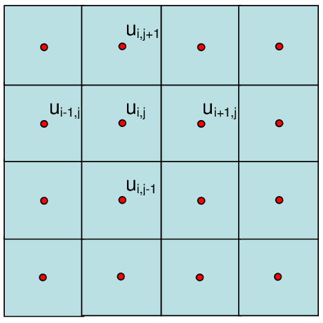

Writing performant Julia code
=============================

.. questions::

   - How should performance be measured?
   - How can I profile my Julia code?
   - Are there any performance pitfalls in Julia?

.. instructor-note::

   - 30 min teaching
   - 20 min exercises

Introducing a toy example
-------------------------

As an example numerical problem, we will consider the discretized Laplace operator which is
used widely in applications including numerical analysis, many physical problems, image processing
and even machine learning. Here we will consider a simple two-dimensional implementation with a
finite-difference formula, which reads:

.. math::

   u_{out}(i,j) = 0.25 [u(i−1,j) + u(i+1,j) + u(i,j−1) + u(i,j+1)]

  An example of the discretization of the 2D Laplace operator.

In Julia, this can be implemented as:

.. literalinclude:: code/performant/lap2d.jl
   :language: julia

Note that we follow the Julia convention of appending an exclamation mark to functions that
mutate their arguments.

We now start by initializing the two 64-bit floating point arrays :math:`u` and :math:`unew`,
and arbitrarily set the boundaries to 10.0 to have something interesting to simulate:

.. code-block:: julia

   function setup(N=4096, M=4096)
       u = zeros(M, N)
       # set boundary conditions
       u[1,:] = u[end,:] = u[:,1] = u[:,end] .= 10.0
       unew = copy(u);
       return u, unew
   end

To simulate something that resembles e.g. the evolution of temperature in a 2D heat conductor
(although we've completely ignored physical constants and time-stepping involved in solving the
heat equation), we could run a loop of say 1000 "time" steps and visualize the results with the
``heatmap`` method of the ``Plots`` package:

.. code-block:: julia

   u, unew = setup()

   for i in 1:1000
       lap2d!(u, unew)
       # copy new computed field to old array
       u = copy(unew)
       # you can using the following expression if you get a warning "Assignment to `u` in soft scope is ambiguous because ..."
       # global u = copy(unew)
   end

   using Plots
   heatmap(u)

Benchmarking
------------

Base Julia already has the ``@time`` macro to print the time it takes to
execute an expression. However, to get more accurate values it is better to
rely on the `BenchmarkTools.jl <https://juliaci.github.io/BenchmarkTools.jl/dev/manual/>`_
framework, which provides convenient macros to perform benchmarking:

- ``@btime``: for quick sanity checks, prints the time an expression takes and the memory allocated
- ``@benchmark``: runs a fuller benchmark on a given expression.

As with `Revise.jl` and `Test.jl`, `BenchmarkTools.jl` should be installed in the base environment:

.. code-block:: julia

   Pkg.activate()
   Pkg.add("BenchmarkTools")

Let us all try it out on the HeatEquation package in the REPL.
We could use the ``Pkg.develop()`` function to clone the repository
into our `~/.julia/dev` folder, which is a good way to work on existing
Julia packages. Here, we instead imagine that we wrote this package and it
exists on our computer, so we start by cloning the repository (or download and
unpack a zip archive) to a new folder:

.. type-along:: Benchmarking

   To perform benchmarking on the ``lap2d!`` function, simply insert ``@benchmark``:

   .. code-block:: julia

      using BenchmarkTools
      @benchmark lap2d!(u, unew)

   We can also capture the output of ``@benchmark``:

   .. code-block:: julia

      bench_results = @benchmark lap2d!(u, unew)
      typeof(bench_results)
      println(minimum(bench_results.times))

Profiling
---------

The `Profile module <https://docs.julialang.org/en/v1/manual/profile/>`_, part of ``Base``,
provides tools to help improve the performance of Julia code.
It relies on `sampling` code at runtime and thus gathering statistical information on where time is spent.
Profiling is particularly useful for identifying bottlenecks in code -
we should remember that "premature optimization is the root of all evil" (Donald Knuth).

Let's go ahead and profile the `lap2d!` function:

.. type-along:: Profiling

   This is how we can profile the ``lap2d!`` function and
   print its results in a tree structure:

   .. code-block:: julia

      Pkg.add("Profile")
      using Profile

      Profile.clear() # clear backtraces from earlier runs
      @profile lap2d!(u, unew)
      Profile.print()

   The information shown is not that easily digestible. Fortunately, the Julia extension
   for VSCode includes a ``@profview`` macro which provides a clearer graphical view:

   .. code-block:: julia

      Pkg.add("ProfileView")
      using ProfileView
      @profview lap2d!(u, unew)

      # if you get a warning like "both ProfileView and VSCodeServer export '@profview'",
      # you can use the following expression in VS Code:
      # VSCodeServer.@profview lap2d!(u, unew)

   We can also look at the same information in a flamegraph by clicking the little fire
   button next to the search area.
   We should now be able to conclude that ``setindex!`` and ``getindex`` functions
   inside ``lap2d!`` take most of the time.

   It should be noted that there are only addition and multiplication operations in
   the ``lap2d!`` function, and these operations just run limited CPU cycles.
   A time-demanding example is provided in `this page <https://www.julia-vscode.org/docs/dev/userguide/profiler/>`_.

Several packages are available for more advanced visualization of profiling results:

- `ProfileView.jl <https://github.com/timholy/ProfileView.jl>`_ is a stand-alone visualizer
  based on GTK.
- `ProfileVega.jl <https://github.com/davidanthoff/ProfileVega.jl>`_
  uses VegaLight and integrates well with Jupyter notebooks.
- `StatProfilerHTML.jl <https://github.com/tkluck/StatProfilerHTML.jl>`_
  produces HTML and presents some additional summaries,
  and also integrates well with Jupyter notebooks.
- `PProf.jl <https://github.com/JuliaPerf/PProf.jl>`_ an interactive, web-based profile
  GUI explorer, implemented as a wrapper around google/pprof.

Optimization options
--------------------

Column-major vs row-major order
^^^^^^^^^^^^^^^^^^^^^^^^^^^^^^^

Multidimensional arrays in Julia are stored in column-major order, i.e.
arrays are stacked one column at a time in memory. This is the same order
as in Fortran, Matlab and R, but opposite to that of C/C++ and Python (numpy).
To avoid cache-misses it is  crucial to order one's loops such that memory is
accessed in a contiguous way!

We can verify this by swapping the loop order in the ``lap2d!`` function and
measure the performance:

.. code-block:: julia

   function lap2d!(u, unew)
       M, N = size(u)
       for i in 2:M-1
           for j in 2:N-1
               unew[i,j] = 0.25 * (u[i+1,j] + u[i-1,j] + u[i,j+1] + u[i,j-1])
           end
       end
   end

.. code-block:: julia

   @benchmark lap2d!(u, unew)

In a set of tests this more than doubled the execution time!

@inbounds
^^^^^^^^^

The ``@inbounds`` macro eliminates array bounds checking within expressions which
can save considerable time. This should only be used if you are sure that no out-of-bounds
indices are used!

Let us add ``@inbounds`` to the inner loop in ``lap2d!`` and benchmark it:

.. literalinclude:: code/performant/lap2d_inbounds.jl
   :language: julia

.. code-block:: julia

   @benchmark lap2d!(u, unew)

Significant speedup should be seen! In a set of tests the execution time as
well as memory consumption were reduced by 50\%.

StaticArrays
^^^^^^^^^^^^

For applications involving *many small arrays*, significant performance can
be gained by using `StaticArrays <https://github.com/JuliaArrays/StaticArrays.jl>`__
instead of normal Arrays. The package provides a range of built-in ``StaticArray``
types, including mutable and immutable arrays, with a *static size known at
compile time*.

Example:

.. code-block:: julia

   Pkg.add("StaticArrays")
   using StaticArrays

   m1 = rand(10,10)
   m2 = @SArray rand(10,10)

   @btime m1*m1
   # 311.808 ns (1 allocation: 896 bytes)

   @btime m2*m2
   # 99.902 ns (1 allocation: 816 bytes)

``StaticArrays`` provide
`many additional features <https://juliaarrays.github.io/StaticArrays.jl/stable/pages/quickstart/>`__,
but unfortunately they can only be used for vectors, matrices and arrays with up
to around 100 elements.

Other performance considerations
^^^^^^^^^^^^^^^^^^^^^^^^^^^^^^^^

Julia's official documentation has an important page on
`Performance tips <https://docs.julialang.org/en/v1/manual/performance-tips/>`_.
Before embarking on any research software project in Julia you
should carefully read this page!

Exercises
---------

.. demo:: Code examples on LUMI cluster.

   .. code-block::

      $ cd /scratch/project_465001310/<YOUR-DIRECTORY>/
	  $ git clone https://github.com/ENCCS/julia-for-hpc.git
      $ cd julia-for-hpc/content/code/performant/
	  $ sbatch performant-batch.sh

.. exercise:: Eliminate array bounds checking

   Insert the ``@inbounds`` macro in the ``lap2d!`` function and
   benchmark it. How large is the speedup?

See also
--------

- [Performance tips](https://docs.julialang.org/en/v1/manual/performance-tips/)

.. keypoints::

   - Always benchmark and profile before optimizing!
   - Optimize bottlenecks in your serial code before you parallelize!
   - `There's a lot to think about <https://docs.julialang.org/en/v1/manual/performance-tips/>`__.
