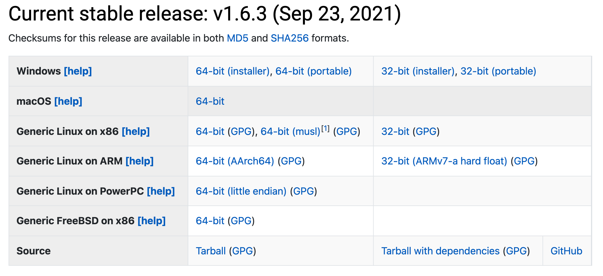
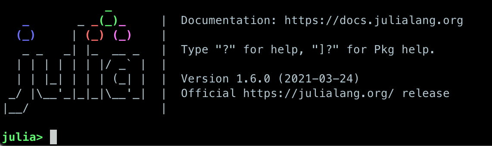

Setup
=====

Please follow the instructions on this page to install both **Julia** and **VS Code** with the Julia 
plugin on your machine.

Installing Julia
----------------

There are two ways to install Julia:

1. Downloading an `installer <https://julialang.org/downloads/#current_stable_release>`__ 
   for your operating system for the latest stable Julia version.
2. Using `Juliaup <https://github.com/JuliaLang/juliaup>`__, the Julia version manager.

Option 2 is (as of October 2022) the recommended installation method on Windows, and while 
`juliaup` is marked as a pre-release on MacOS and Linux it already works smoothly there too.

The benefit of `juliaup` is that it allows users to install specific Julia versions, it alerts 
users when new Julia versions are released and it provides a convenient Julia release channel 
abstraction.

Both installation methods are documented here. If you are on Windows we recommend using 
`juliaup`. If you are on MacOS or Linux, choose the installation method you feel most 
comfortable with.

1. Using the Julia installer
^^^^^^^^^^^^^^^^^^^^^^^^^^^^

First download the latest stable release of Julia for your operating system 
`from the julialang.org website <https://julialang.org/downloads/#current_stable_release>`_.

Follow the instructions to complete the installation.

Platform-specific instructions can be found at 
https://julialang.org/downloads/platform/. It is convenient to be able 
to run Julia from the command line, so follow the instructions for 
"adding Julia to PATH".  
For Windows users who do not already have a terminal installed,
we recommend to install the 
`Windows Terminal from the Microsoft Store <https://www.microsoft.com/sv-se/p/windows-terminal/9n0dx20hk701?rtc=1&activetab=pivot:overviewtab>`_.

2. Using Juliaup      
^^^^^^^^^^^^^^^^

Full instructions can be found at https://github.com/JuliaLang/juliaup.

In short:

- On Windows you can install Julia and Juliaup either through the 
  `Windows store <https://www.microsoft.com/store/apps/9NJNWW8PVKMN>`__ or on a command line 
  by executing `winget install julia -s msstore`.
- On MacOS or Linux, type `curl -fsSL https://install.julialang.org | sh` on a command line 
  and follow the instructions.  

Checking your installation
^^^^^^^^^^^^^^^^^^^^^^^^^^

Regardless of how you installed Julia, please ensure that you can open the Julia REPL by
typing ``julia`` on the command line in a terminal, or by clicking the Julia 
icon on your Desktop or Applications folder. You should
see something like in the image below (nevermind the version number).

To exit the REPL again, hit ``CTRL-d`` or type ``exit()``.

Installing Visual Studio Code
-----------------------------

First install VSCode according to the official documentation: 
https://code.visualstudio.com/Download

Installing the VSCode Julia extension
^^^^^^^^^^^^^^^^^^^^^^^^^^^^^^^^^^^^^

After starting VSCode, 
click the Extensions button on the left-side menu, type `Julia` and 
click `Install` to install the Julia extension.

.. figure:: img/vscode_extensionbutton.png
   :align: center
   :scale: 50 %

.. figure:: img/vscode_juliaextension.png
   :align: center
   :scale: 50 %

You now need to configure the Julia extension and set the path 
to the Julia executable. Click the cogwheel button next to the Julia 
extension:

.. figure:: img/vscode_extensionconfig.png
   :align: center
   :scale: 50 %

Then find the "Julia: Executable Path" field:

.. figure:: img/vscode_execpath.png
   :align: center
   :scale: 50 %

In this field enter the path to the Julia executable that you have installed.

If you are curious, scroll through the other possible configuration settings!

Installing packages
-------------------

A number of Julia packages is used in this lesson. These can be installed on-the-fly 
during a workshop, but you can also follow the instructions below to install all packages 
in your global Julia environment.

Copy-paste the following text into a file called Project.toml, which 
you can for example place under a new directory `julia` in your home directory:

.. code-block:: toml

   name = "Julia-for-HPC"
   [deps]
   BenchmarkTools = "6e4b80f9-dd63-53aa-95a3-0cdb28fa8baf"
   Distributed = "8ba89e20-285c-5b6f-9357-94700520ee1b"
   LinearAlgebra = "37e2e46d-f89d-539d-b4ee-838fcccc9c8e"
   MPI = "da04e1cc-30fd-572f-bb4f-1f8673147195"
   MPIPreferences = "3da0fdf6-3ccc-4f1b-acd9-58baa6c99267"
   Plots = "91a5bcdd-55d7-5caf-9e0b-520d859cae80"
   Profile = "9abbd945-dff8-562f-b5e8-e1ebf5ef1b79"
   SharedArrays = "1a1011a3-84de-559e-8e89-a11a2f7dc383"
   StaticArrays = "90137ffa-7385-5640-81b9-e52037218182"

Then open a Julia REPL and specify the location of the Project.toml file:

.. code-block:: console

   $ julia --project=/path/to/Project.toml

Then copy-paste the following code into your Julia session:

.. code-block:: julia

   using Pkg
   Pkg.instantiate()

It could take a couple of minutes to download and install the packages. 
After it completes you should be able to list all installed packages:

.. code-block:: julia 

   Pkg.status()

   # Status `~/julia/Project.toml`
   #   [6e4b80f9] BenchmarkTools v1.3.1
   #   [da04e1cc] MPI v0.20.3
   #   [3da0fdf6] MPIPreferences v0.1.6
   #   [91a5bcdd] Plots v1.35.6
   #   [90137ffa] StaticArrays v1.5.9
   #   [8ba89e20] Distributed
   #   [37e2e46d] LinearAlgebra
   #   [9abbd945] Profile
   #   [1a1011a3] SharedArrays   

Configuring MPI
^^^^^^^^^^^^^^^

Using MPI in Julia requires an MPI library. On an HPC system it is best to use a preinstalled 
MPI library, but on personal computers it's best to let the MPI.jl package install its own 
library and wrapper for the ``mpiexec`` command. Do this by:

.. code-block:: julia

   using MPI
   MPI.install_mpiexecjl()

This installs a ``mpiexecjl`` under ``~/.julia/bin``, which should be added to your 
``PATH`` variable. 

Using EuroHPC systems
---------------------

.. tabs:: 

   .. tab:: Meluxina

      To reserve an interactive node (replace project (-A), QOS (-q) and reservation (--res) 
      as needed):

      .. code-block:: console

         $ salloc -A p200051 -t 0:10:0 -p cpu  -n 1  -q dev --res cpudev

      To run a batch job to run an MPI job, create a job script similar to the following:

      .. code-block:: bash

         #!/bin/bash -l
         #SBATCH -A p200051
         #SBATCH -t 00:10:00
         #SBATCH -q test
         #SBATCH -p cpu
         #SBATCH -N 1
         #SBATCH --ntasks-per-node=8

         module load OpenMPI
         module load Julia

         n=$SLURM_NTASKS
         srun -n $n julia mpi_program.jl

(Optional) Installing JupyterLab and a Julia kernel
---------------------------------------------------

JupyterLab can most easily be installed through the full
Anaconda distribution of Python packages or the minimal
Miniconda distribution.

To install Anaconda, visit
https://www.anaconda.com/products/individual , download an installer
for your operating system and follow the instructions. JupyterLab and
an IPython kernel are included in the distribution.

To install Miniconda, visit
https://docs.conda.io/en/latest/miniconda.html , download an installer
for your operating system and follow the instructions.  After
activating a ``conda`` environment in your terminal, you can install
JupyterLab with the command ``conda install jupyterlab``.

Add Julia to JupyterLab
^^^^^^^^^^^^^^^^^^^^^^^

To be able to use a Julia kernel in a Jupyter notebook you need to
install the ``IJulia`` Julia package. Open the Julia REPL and type::

  using Pkg
  Pkg.add("IJulia")

Create a Julia notebook
^^^^^^^^^^^^^^^^^^^^^^^

Now you should be able to open up a JupyterLab session by typing
``jupyter-lab`` in a terminal, and create a Julia notebook by clicking
on Julia in the JupyterLab Launcher or by selecting File > New > Notebook
and selecting a Julia kernel in the drop-down menu that appears.

